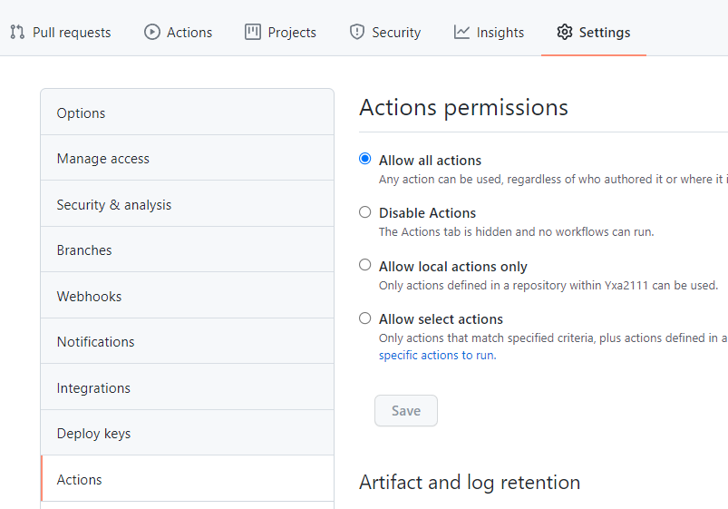

# qdu_info_submit

QDU校园集结号每日上报+github action，利用后者实现自动化

inspired by [@kxkxk](https://github.com/kxkxk), thanks a lot!

some of api request is based on [antlinkercampus](https://github.com/jj4/antlinkercampus).

# Please keep slience!🤐

# How to use ?

1. 注册你的Github账号
2. 点击首页的加号，选择`Import Repository`，clone URL填`https://github.com/Yxa2111/qdu_info_submit.git`，名字随意，然后设置为private。

3. 进入新导入的repo，选择Settings -- Actions，选择`Allow all actions`然后Save。

4. 在刚刚的Settings里，点击Scrects，然后点击右边的`New Repository Screct`按钮，添加一个新的screct。Name中填`PHONE`，Value中填你的`your phone number here which registered 校园集结号`

5. 遵循上面的步骤，分别填写Name为`PASSWORD`，Value为`your password`的screct和Name为`KEYWORD`，Value为`体温`的screct。

6. 在你的Repo上点击一下Star，如果已经Stared过就先Unstar再Star。这会触发一个模板生成的Action，大概30s之后你就会发现你的Repo多了一个Github Bot的Push，你的Repo会多了一个`template.json`的文件。它是表格模板。

7. 打开`template.json`，根据个人需要修改相应的内容。然后添加一个Name为`FIELDS`的screct，内容就填修改后的`template.json`的内容

8. enjoy it! 你可以随便push一个commit来触发action，看下结果如何。之后的运行结果可以在Actions里看到，每天大概四小时运行一次。

# 如果表格内容变了怎么办

如果内容有变，定时Submit会失败，然后会给你发邮件。到时候去Actions看一下是否是表格内容更新了。

如果是，重新做一遍步骤6，7，更新下`template.json`和Name为`FIELDS`的screct。

# Extra: 邮件通知

进入`https://github.com/settings/notifications`，然后在Action里取消勾选`Send notifications for failed workflows only`
